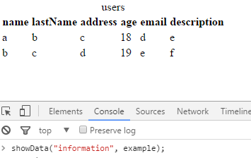

# JSON to table.
## Module to pass a JSON to table of HTML using JavaScript.

### Description
To use this module has:
~~~javascript
  function showData(div, json)
~~~
Where the first argument it receives is the id of the div to use, and the second argument is the required json displayed in a table.

This function is responsible for taking JSON data and incorporates them into an HTML table.

### Implementation with web browser.
JSON structure:
~~~javascript
var example = {
  users: [{
    name: "a",
    lastName: "b",
    address: "c",
    age: 18,
    email: "d",
    description: "e"
  }, {
    name: "b",
    lastName: "c",
    address: "d",
    age: 19,
    email: "e",
    description: "f"
  }]};
~~~
Table.html file:
~~~html
<!DOCTYPE html>
<html lang="en">
<head>
  <meta charset="UTF-8">
  <title>Example Table</title>
  
</head>
<body>
  

</body>
</html>
~~~
Open web browser console and run:
~~~javascript
  showData("information", example);
~~~
Result:

---

# JSON to table
## Módulo para pasar un JSON a una tabla de HTML utilizando JavaScript.

### Descripción.
Para utilizar éste módulo se cuenta con la función:

~~~javascript
  function showData(div, json)
~~~
Donde el primer argumento que recibe es el id del div a utilizar, y el segundo argumento es el json que se requiere mostrar en una tabla.

Ésta funcion se encarga de tomar los datos del JSON y los incorpora en una tabla de HTML.

### Implementación con el navegador web.
Estructura del JSON:
~~~javascript
var example = {
  users: [{
    name: "a",
    lastName: "b",
    address: "c",
    age: 18,
    email: "d",
    description: "e"
  }, {
    name: "b",
    lastName: "c",
    address: "d",
    age: 19,
    email: "e",
    description: "f"
  }]};
~~~
Archivo table.html:
~~~html
<!DOCTYPE html>
<html lang="en">
<head>
  <meta charset="UTF-8">
  <title>Example Table</title>
  
</head>
<body>
  

</body>
</html>
~~~
Abrir la consola del navegador web y ejecutar:
~~~javascript
  showData("information", example);
~~~
Resultado:

